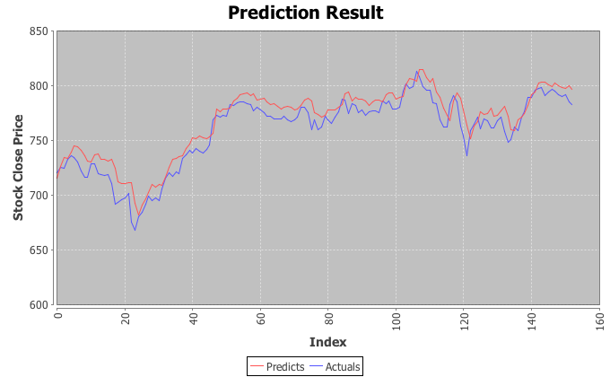

# Plain Stock Prediction

-blue.svg)      

Plain Stock Price Prediction via RNNs with Graves LSTM unit.

Training and Predicting a specific feature by setting `PriceCategory` in `com.isaac.stock.predict.StockPricePrediction.java` as:
```java
PriceCategory category = PriceCategory.CLOSE; // CLOSE: train and predict close price
// or
PriceCategory category = PriceCategory.OPEN; // OPEN: train and predict open price
// ...
```
The `PriceCategory` enum:
```java
public enum PriceCategory {
    OPEN, CLOSE, LOW, HIGH, VOLUME, ALL
}
```
Predicting all features as:
```java
PriceCategory category = PriceCategory.ALL; // ALL: train and predict all features
```

**Demo Result**



**A Useful GitHub Repository**: [timestocome/Test-stock-prediction-algorithms](https://github.com/timestocome/Test-stock-prediction-algorithms), which contains much information, methods and sources about predict stock and market movements.
